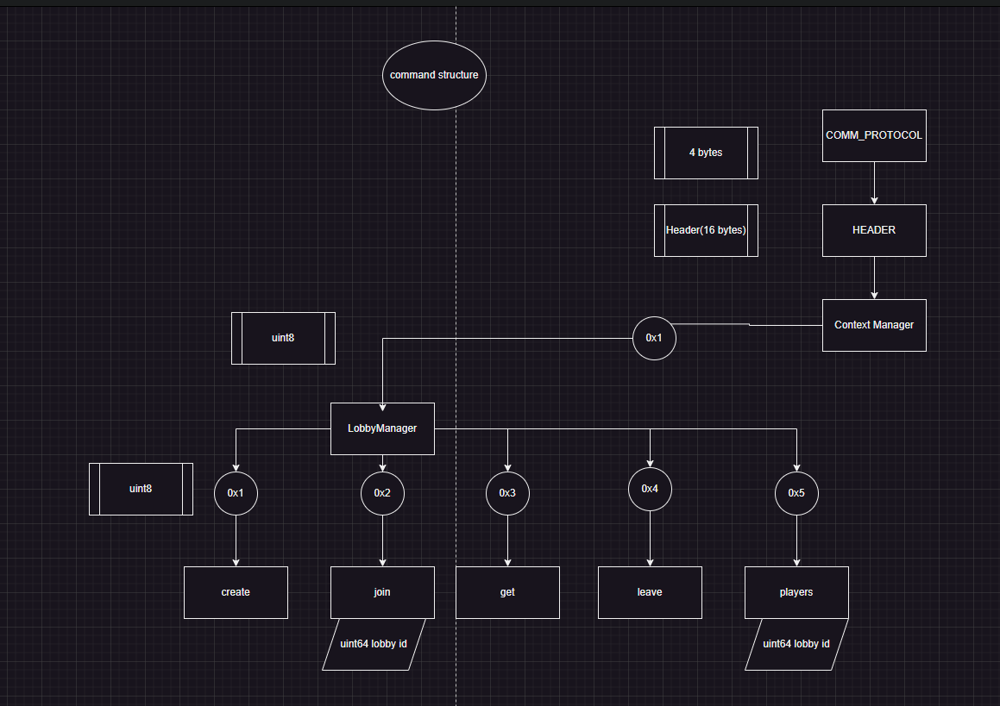

# Text Editor (Total War)

compile with clion the following target:
```
run_game_server
```

the game server starts on udp port 8080

to utilize the game server, you can use the `client.py`.
It already has all the required command parsing currently available. It just transforms commands from human readable format to bytestreams and sends them to the server.
Client is currently Ubuntu-only.

```
$ python3 ./client.py
(b'pB\xe1\x1c\x01\x00\x00\x00\x00\x00\x00\x00\x00\x00\x00\x00\x00\x00\x00\x00', ('127.0.0.1', 8080))
> help
        lobby: lobby commands; `lobby help` for more info

```
lobby commands;
```
> lobby help
        usage: lobby <create|get|join|parse_leave|players> ... args
                create: create a new lobby
                get: get all lobbies
                join <lobby_id>: join a lobby
                leave: parse_leave the current lobby
                players <lobby_id>: get all players in a lobby

```
sample server logs:
```
starting server on udp address 0.0.0.0:8080
client has connected: 127.0.0.1:43654
client has connected: 127.0.0.1:48437
lobby: 1
lobby: 1
        player: 2
        player: 1
lobby: 1
        player: 1
lobby: 1
        player: 2
        player: 1
dud command from player: 2
client has connected: 127.0.0.1:45598
```
currently all "get" requsets are not implemented. They are just logged by the server.
the "dud" command is a command that had wrong arguments/ had invalid state; 
the server should send some error message to the client.

## protocol diagram


